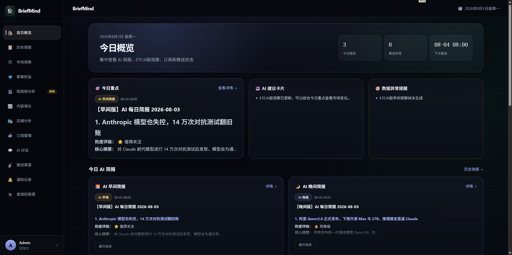
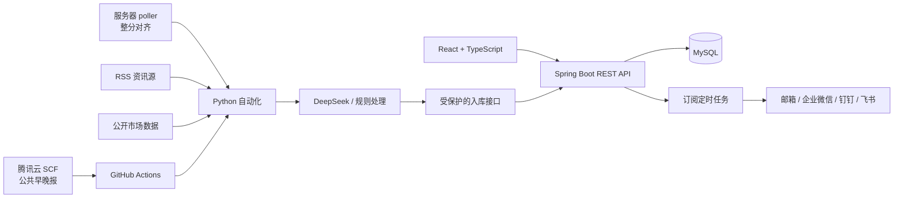

<div align="center">
  

# BriefMind

**Bot-Brief · AI 简报与运营分析工作台**

聚合 AI 资讯与公开市场数据，结合 DeepSeek、规则分析和多渠道推送，
为资讯阅读、内容运营与店铺经营提供可追溯的日常工作流。

[在线演示](http://124.222.194.103/) · [核心功能](#核心功能) · [系统架构](#系统架构) · [快速开始](#快速开始)



</div>

## 项目定位

**BriefMind** 是产品名称，**Bot-Brief** 是代码仓库名称。项目从 AI 资讯简报工具演进为一个前后端分离的全栈工作台，目前覆盖：

- AI 资讯早报、晚报生成与历史归档
- ETF / A 股市场观察与估值数据记录
- 用户订阅、兴趣筛选和多渠道定时推送
- 内容作品数据管理与 DeepSeek 增长分析
- 店铺 CSV 数据导入与规则化经营分析
- JWT 认证、邀请码注册和公开只读 Demo

项目将大模型能力用于适合生成与分析的场景，同时保留确定性数据校验和规则逻辑，避免把所有功能包装成 AI。

## 核心功能

| 模块 | 当前能力 | 实现边界 |
| --- | --- | --- |
| 账户与权限 | JWT 登录、邀请码注册、管理员邀请码、普通账号与 Demo 账号隔离 | Demo 使用固定合成数据并限制写操作 |
| AI 早晚简报 | RSS 聚合、关键词评分、标题去重、DeepSeek 生成、Markdown 入库 | 当前来源为配置好的 RSS，不是通用网页爬虫 |
| 历史简报 | 分页、版次、日期、关键词筛选和 Markdown 详情 | 报告由自动化任务统一写入后端 |
| 简报问答 | 从近期报告中匹配关键词，将相关内容交给 DeepSeek 回答并返回来源 | 属于轻量检索增强，不含向量数据库 |
| 市场观察 | 沪深 300 ETF、纳指 100 ETF、标普 500 ETF 行情、估值、历史价格和风险提示 | 报告主要由规则生成，不提供收益预测或买卖建议 |
| 订阅与推送 | 按主题勾选、每个主题一个时刻和星期范围、邮箱 / 企业微信 / 钉钉 / 飞书 | 同一主题在同一 6 小时时段只生成一次，按用户选的时刻展示和推送 |
| 推送记录 | 渠道测试、成功/失败日志、安全化错误信息和重复分发控制 | 第三方渠道需要自行配置凭据 |
| 内容增长 | 内容账号、作品 CRUD、CSV 导入、互动指标、爆款/选题/改稿分析 | 平台账号和作品目前以手工录入、CSV 为主 |
| 店铺分析 | 商品、销售、客户、库存分析，CSV 预览确认和经营日报 | 经营日报当前由指标规则生成 |
| 公开 Demo | 无需注册即可浏览固定演示数据 | 是否开放由部署环境变量控制 |

> 市场观察仅用于数据展示和项目研究，不构成投资建议、证券推荐或任何买卖依据。

## 产品工作流

### AI 简报

1. Python 从机器之心、量子位、Hacker News、VentureBeat AI、MIT Technology Review、TechCrunch 等 RSS 获取资讯。
2. 根据关键词、来源和发布时间评分，并对规范化标题去重。
3. DeepSeek 生成结构化早报或晚报。
4. 自动化任务将报告推送到企业微信，并通过受保护的入库接口保存到 MySQL。
5. 用户在 Dashboard、历史简报和详情页中查看内容。

### 个性化分发

1. 用户按主题订阅：勾选兴趣，再为每个主题选星期范围和一个时刻；同一主题在同一 6 小时时段只能订一次。
2. 用户添加邮箱、企业微信、钉钉或飞书渠道，并把渠道绑到对应主题，也可先执行测试推送。
3. 服务器 poller 按四个时间段（00–06 / 06–12 / 12–18 / 18–24）生成主题段；网页展示和渠道推送仍按用户选的时刻。
4. Spring Boot 每分钟扫描到期订阅，按日期、主题窗口、用户和渠道防止重复发送。
5. 推送结果写入通知记录；主题无资讯或生成失败会记入状态，本时间段不再重跑。

### 内容与店铺分析

- 内容增长模块支持作品指标管理、CSV 导入，以及 DeepSeek 爆款原因、选题和改稿分析。
- 店铺分析模块支持 CSV 模板、预览校验、确认导入、销售趋势、商品排行、客户摘要和库存建议。
- AI 简报与内容增长分析会调用 DeepSeek；市场观察与店铺经营日报主要使用确定性规则。

## 系统架构



系统中存在三条调度链路：

- 腾讯云 SCF 仍只负责公共早/晚报和市场观察，不需要按每个订阅时刻再加定时。
- 服务器上的 poller 按北京时间整分对齐，并提前约 30 分钟爬取和生成；用户设置的时刻只负责网页展示和外推。
- Spring Boot 每分钟按用户时刻拼报，并推送到订阅里绑定的渠道。

## 工程实现亮点

- **认证与隔离**：Spring Security + JWT 无状态鉴权，普通账号、管理员和 Demo 账号具有明确边界。
- **安全入库**：自动化任务通过独立 `X-Ingest-Token` 写入报告、ETF 价格和估值数据。
- **凭据保护**：推送目标与签名密钥支持 AES-GCM 加密存储，接口不返回明文凭据。
- **多租户数据**：订阅、渠道、内容账号、作品和店铺数据按当前用户隔离。
- **推送幂等**：持久化分发标识，避免同一日期、版次、用户和渠道重复推送。
- **可靠导入**：店铺 CSV 采用模板、预览校验、文件哈希确认和业务键覆盖流程。
- **市场数据校验**：行情和估值链路包含多数据源、重试、日期校验和后端历史缓存。
- **自动化测试**：GitHub Actions 执行 Python 市场数据单元测试和 Maven 后端测试。

## 技术栈

| 层次 | 技术 |
| --- | --- |
| 前端 | React 18、TypeScript 5、Vite 4.5、Ant Design 5、React Router 6、Axios、React Markdown |
| 后端 | Java 17、Spring Boot 3.2、Spring Security、MyBatis-Plus 3.5、MySQL 8、JJWT |
| 自动化 | Python 3.11、feedparser、requests、OpenAI-compatible Python SDK |
| AI | DeepSeek API |
| 工程化 | Maven、npm、Docker Compose、Nginx、GitHub Actions |
| 外部调度 | 腾讯云 SCF |

## 快速开始

### 1. 环境要求

- Git
- Node.js 18+
- Java 17
- Maven 3.9+
- MySQL 8
- Python 3.11（仅运行自动化任务时需要）
- DeepSeek API Key（仅调用 AI 功能时需要）

### 2. 获取代码

```bash
git clone https://github.com/1539327601whj/Bot-Brief.git
cd Bot-Brief
```

### 3. 初始化数据库

项目当前没有集成 Flyway 或 Liquibase，需要手工执行基础脚本和版本化 SQL。首次初始化请按以下顺序执行：

```bash
mysql -u root -p < backend/sql/init.sql
mysql -u root -p ai_daily < backend/sql/V2__multi_tenant.sql
mysql -u root -p ai_daily < backend/sql/V3__content_growth.sql
mysql -u root -p ai_daily < backend/sql/V3__shop_analytics.sql
mysql -u root -p ai_daily < backend/sql/V4__shop_csv_import.sql
mysql -u root -p ai_daily < backend/sql/V4__subscription_topic_schedules.sql
mysql -u root -p ai_daily < backend/sql/V5__demo_account.sql
mysql -u root -p ai_daily < backend/sql/V6__push_delivery_hardening.sql
mysql -u root -p ai_daily < backend/sql/V7__market_data_history.sql
mysql -u root -p ai_daily < backend/sql/V8__report_ingest_idempotency.sql
mysql -u root -p ai_daily < backend/sql/V9__report_business_date_idempotency.sql
mysql -u root -p ai_daily < backend/sql/V10__topic_sections_and_user_reports.sql
mysql -u root -p ai_daily < backend/sql/V11__topic_windows_and_display_time.sql
mysql -u root -p ai_daily < backend/sql/V12__ops_heartbeat_and_generation_status.sql
```

在已有数据库上执行 V6 及之后的变更前，请先备份数据库并阅读脚本内说明。现网升级到按主题推送前必须先跑 V10、V11 和 V12（V12 提供 poller 心跳和主题生成状态表），否则后端发布会被拦住。

### 4. 配置后端

后端通过环境变量读取配置。下面是本地开发所需的核心变量：

```bash
export DB_HOST=localhost
export DB_PORT=3306
export DB_NAME=ai_daily
export DB_USER=root
export DB_PASSWORD=your-database-password

export JWT_SECRET=replace-with-a-random-secret-at-least-32-bytes
export ADMIN_EMAIL=admin@example.com
export ADMIN_PASSWORD=replace-with-a-strong-password
export DEEPSEEK_API_KEY=your-deepseek-api-key
```

可选能力使用以下变量：

| 变量 | 用途 |
| --- | --- |
| `REPORT_INGEST_TOKEN` | 自动化任务写入报告和市场数据的共享令牌 |
| `PUSH_CHANNEL_ENCRYPTION_KEY` | Base64 编码的 32 字节渠道加密密钥 |
| `MAIL_HOST` / `MAIL_PORT` | SMTP 服务地址和端口 |
| `MAIL_USERNAME` / `MAIL_PASSWORD` | SMTP 认证信息 |
| `MAIL_FROM_NAME` | 邮件发件人名称 |
| `DEMO_ENABLED` | 是否启用公开只读 Demo |
| `DEMO_EMAIL` / `DEMO_DISPLAY_NAME` | Demo 账号信息 |
| `DEMO_TOKEN_EXPIRATION_MINUTES` | Demo Token 有效期 |

不要把数据库密码、JWT 密钥、API Key、Webhook 或入库令牌提交到 Git。

### 5. 启动后端

```bash
cd backend
mvn spring-boot:run
```

后端默认运行在 `http://localhost:8081`，健康检查地址：

```text
http://localhost:8081/api/health
```

启动时会根据 `ADMIN_EMAIL` 和 `ADMIN_PASSWORD` 初始化管理员。普通用户注册需要管理员创建的邀请码。

### 6. 启动前端

打开另一个终端：

```bash
cd frontend
npm ci
npm run dev
```

访问 `http://localhost:5173`。开发环境中的 `/api` 请求由 Vite 代理到 `http://localhost:8081`。

### 7. 运行自动化任务（可选）

```bash
python -m pip install -r automation/requirements.txt
```

AI 简报主要使用：

```text
DEEPSEEK_API_KEY
WECHAT_WEBHOOK
BACKEND_API_URL
REPORT_INGEST_TOKEN
EDITION=morning|evening
```

市场观察主要使用：

```text
ETF_WECHAT_WEBHOOK
BACKEND_API_URL
REPORT_INGEST_TOKEN
EDITION=evening
ETF_SYNC_ONLY=false
```

本地调试时请使用测试 Webhook 和测试数据库，避免误推送到生产渠道。

## 项目结构

```text
Bot-Brief/
├── frontend/               React Web 应用与 Nginx 镜像
├── backend/                Spring Boot API、测试和 SQL 脚本
├── automation/             AI 简报、市场观察脚本及测试
├── .github/workflows/      测试、任务执行和服务器部署
├── docker-compose.yml      前后端生产容器编排
└── README.md
```

## 测试

```bash
# Python 自动化测试
python -m unittest discover -s automation/tests -p "test_*.py" -v

# Java 后端测试
mvn -f backend/pom.xml test

# 前端类型检查与生产构建
npm --prefix frontend run build
```

`.github/workflows/market-data-tests.yml` 会在相关代码推送或提交 Pull Request 时运行 Python 和 Java 测试。

## 自动化与部署

- `daily.yml` 和 `etf-daily.yml` 提供公共早/晚报与市场观察的 `workflow_dispatch` 入口，生产上仍可由腾讯云 SCF 在 8:00、20:00 触发。
- 订阅生成由服务器 `poller` 按整分对齐执行，覆盖网页上任意订阅时刻，无需按时刻配置 SCF；`daily-poll.yml` 仅用于手动补跑。
- `deploy-frontend.yml` 和 `deploy-backend.yml` 在 `main` 分支相关目录变化时独立部署服务。
- GitHub runner 检出目标提交并构建带提交 SHA 的 Docker 镜像，再通过 SSH/SCP 上传到服务器；服务器不再访问 GitHub，也不在部署阶段构建镜像。
- 上传文件会进行 SHA256 校验，容器启动后自动检查前端首页和后端 `/api/health`；检查失败时恢复部署前的镜像。
- 前后端共享部署并发锁，分别绑定到服务器回环地址 `127.0.0.1:8080` 和 `127.0.0.1:8081`。
- MySQL 是外部服务，不包含在当前 `docker-compose.yml` 中；服务器需预先保留 `mysql:8.0` 镜像供部署前 schema 检查使用。
- 域名、TLS 和 `/api` 反向代理由服务器外层网关负责，未包含在本仓库中。

### 部署 SSH 配置

在可信设备上创建专用部署密钥，不要给私钥设置交互式密码：

```bash
ssh-keygen -t ed25519 -C "bot-brief-deploy" -f bot_brief_deploy
```

将 `bot_brief_deploy.pub` 的内容追加到服务器部署用户的 `~/.ssh/authorized_keys`，并确保权限正确：

```bash
chmod 700 ~/.ssh
chmod 600 ~/.ssh/authorized_keys
```

人工核对服务器 SSH 主机指纹后，将完整 known_hosts 行保存为 Secret；以下命令只用于获取候选值，必须通过服务器控制台执行 `ssh-keygen -lf /etc/ssh/ssh_host_ed25519_key.pub` 交叉核对：

```bash
ssh-keyscan -H <SERVER_IP>
```

在 GitHub 仓库 `Settings → Secrets and variables → Actions` 中配置：

- `SERVER_IP`：服务器地址。
- `SERVER_USER`：已安装部署公钥的用户。
- `SERVER_SSH_KEY`：`bot_brief_deploy` 私钥的完整内容。
- `SERVER_HOST_KEY`：核对后的服务器 known_hosts 完整行。
- 后端工作流原有的数据库、JWT、邮件和第三方服务 Secrets。

首次切换前确保服务器满足：

```bash
docker compose version
docker image inspect mysql:8.0 >/dev/null
mkdir -p /opt/Bot-Brief
```

新工作流验证成功后可以删除不再使用的 `SERVER_PASSWORD`。

## 当前限制与路线图

以下能力仍在规划或尚未开放：

- 内容平台数据自动同步与竞品作品追踪
- Creator Tools 完整短视频分析能力
- 用户自选 ETF / 股票及个性化市场提醒
- 电商平台 API、套餐支付、积分和自助开通
- 更完整的前端自动化测试与移动端导航

## 安全说明

- 生产环境必须覆盖默认 JWT 密钥和管理员密码。
- `REPORT_INGEST_TOKEN`、`PUSH_CHANNEL_ENCRYPTION_KEY`、Webhook、SMTP 密码和数据库密码必须使用安全的 Secret 管理方式。
- 公开 Demo 应只使用合成数据，且不应开放真实写操作或真实第三方凭据。
- 本仓库当前未附带开源许可证；未经明确授权，不应将代码视为已获得开源使用许可。
